# Book Register

<p align="center"></p>

書記 是一个适用于学校图书室 多人协作共同完成图书录入任务 的在线工作站

数据存储到 MySQL 数据库，可以一键导出为 Excel

数据字段包含 `类目名` `编号` `书名` `出版社` `备注`

> 旨在完成图书室书籍录入任务... 做做项目练练手 (￣▽￣")

采用 PHP, Lumen Framework, NodeJS, WebSocket, ...

> 本项目使用 GPL3.0 开源协议，未经允许代码和衍生品不得用于商业用途，侵权必究

# Features
- 美观友好的 UI
- 快速上手 简单的操作
- 多人协作 多人完成同一类目
- 实时弹幕 全局显示用户动作
- 在线监测 不活跃成员查看
- 自动补全 快速输入
- 数据统计 成员战绩分析
- 导出 所有/单个 类目为一整个 .xls 文件
- 带 API, 运用 AJAX, Web Socket...

# Requirements
- [PHP](http://www.php.net/) >= 7.0
	- [Lumen](https://github.com/laravel/lumen)
- [NodeJS](http://nodejs.cn/)
    - [ws](https://github.com/websockets/ws)

# Quick Start
```sh
git clone https://github.com/Zneiat/book-register.git
composer install

php -r "copy('.env.example', '.env');"
# 然后到 .env 里配置数据库连接

php artisan key:generate
php artisan migrate

# 实时弹幕必须
nmp install
node socket-func

# DEV
php -S localhost:8000 -t public
```

> P.S. Windows Server 可下载 [NSSM](http://nssm.cc) 后执行项目中的 `socket-func-install.bat` 让 `node socket-func ` 持久运作

# Donate
如果您觉得我的项目对您有帮助，并且您愿意给予我一点小小的支持，您可以通过以下方式向我捐赠，这样可以维持项目持续地发展，非常感谢！ヽ(•̀ω•́ )ゝ

If you are enjoying this app, please consider making a donation to keep it alive.

| Alipay | Wechat | 
| :------: | :------: | 
|  |  | 

# Author
[ZNEIAT](http://www.qwqaq.com)

# License
[書記](https://github.com/Zneiat/book-register) Copyright (C) 2018 [Zneiat](http://www.qwqaq.com "Author Blog")

# Screenshots

### Latest
<p align="center">
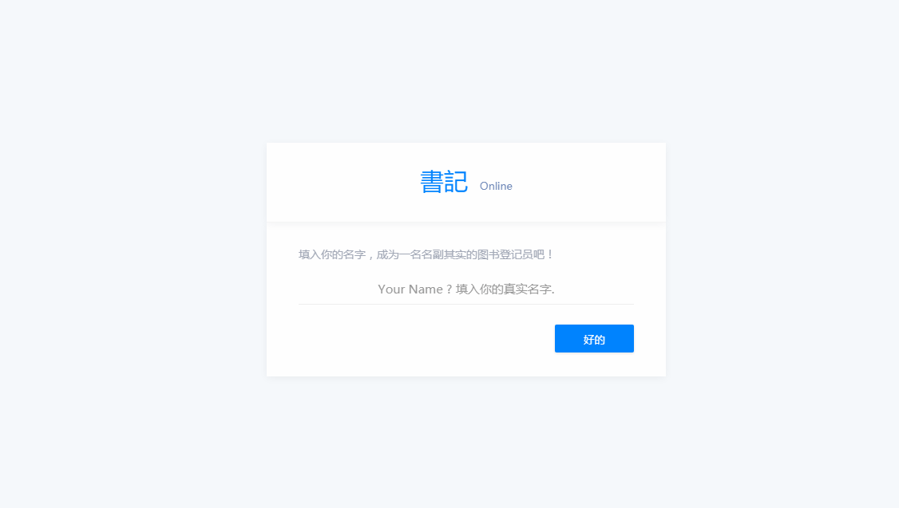
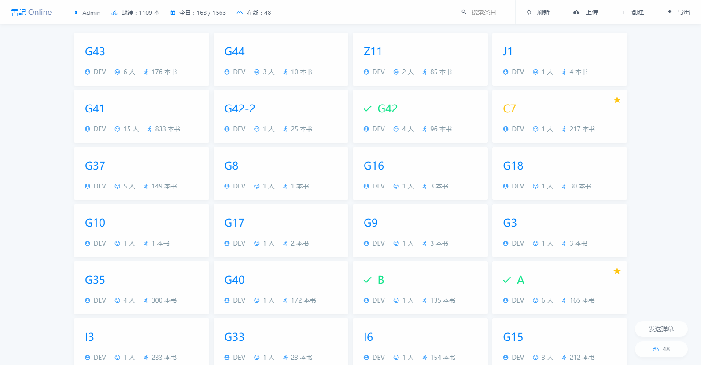

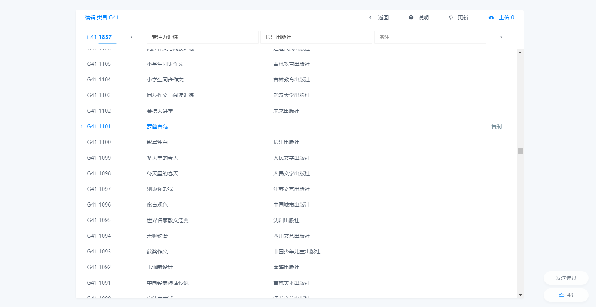
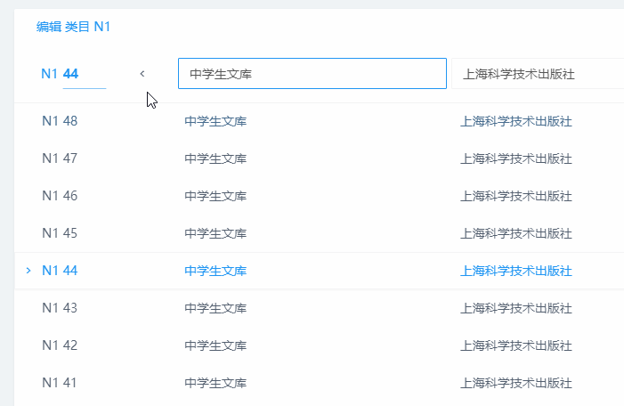
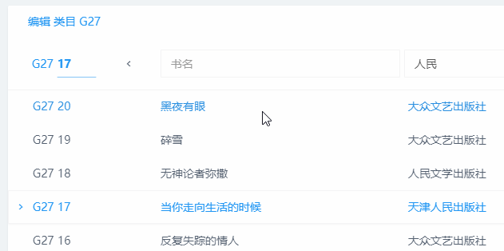
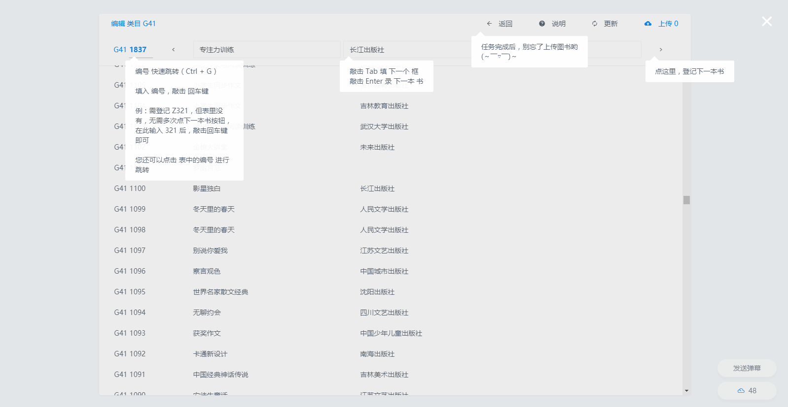
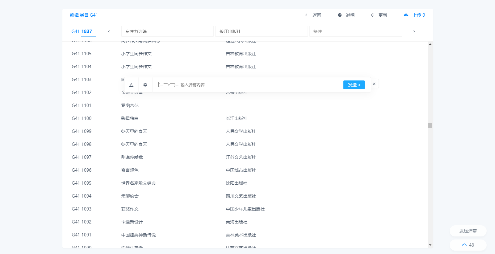
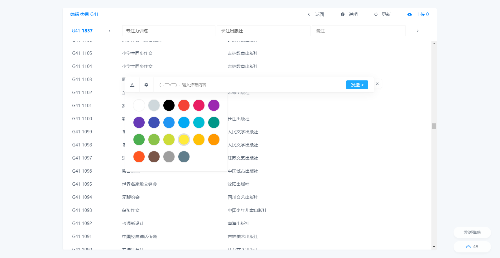
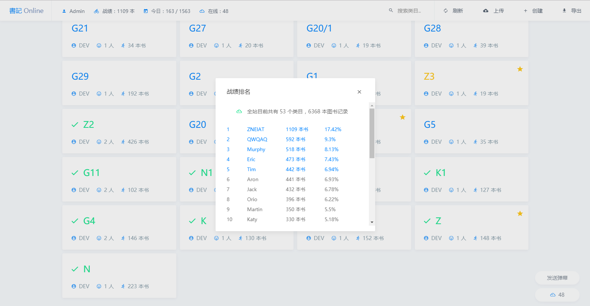
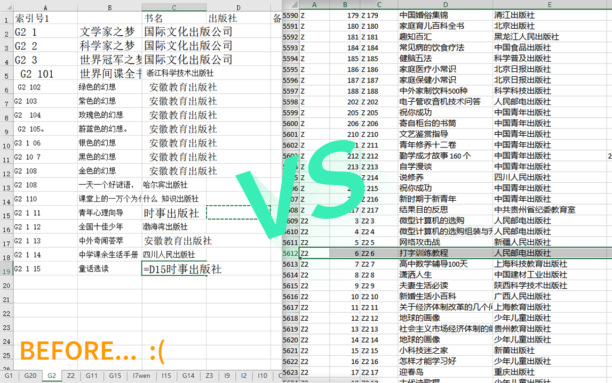
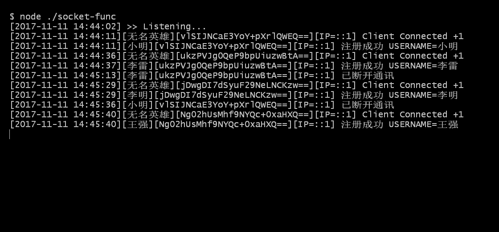
</p>

### 2017-10-28
<p align="center">
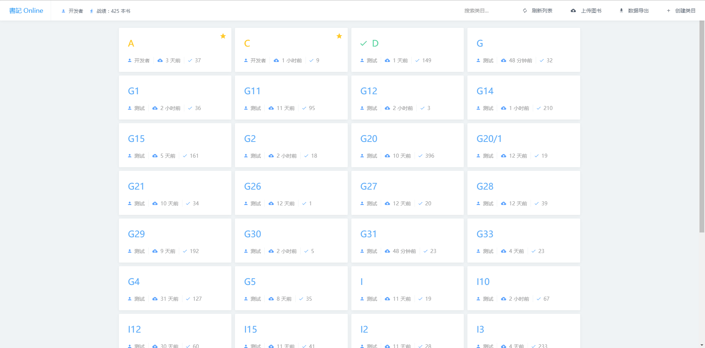
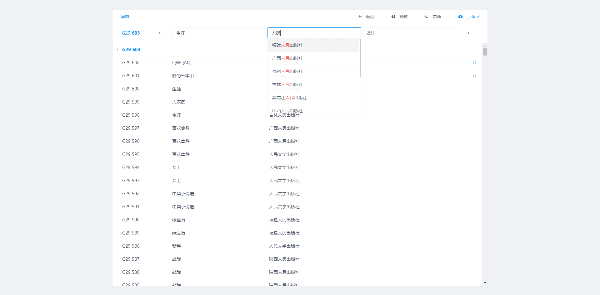
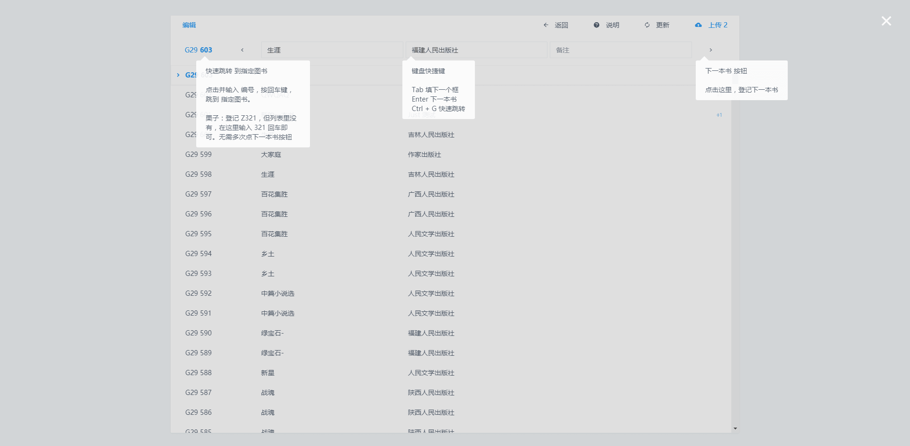
</p>

### 2017-10-23
<p align="center">
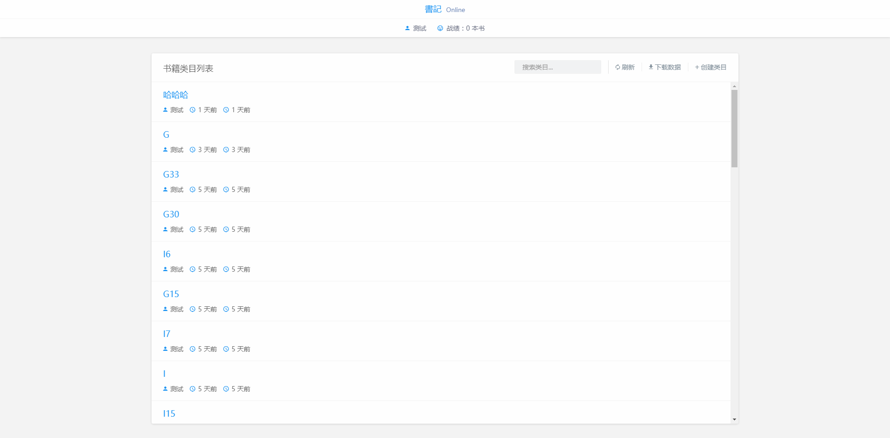
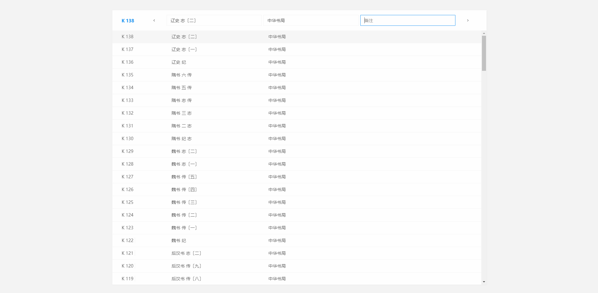
</p>

### 2017-10-6
<p align="center">
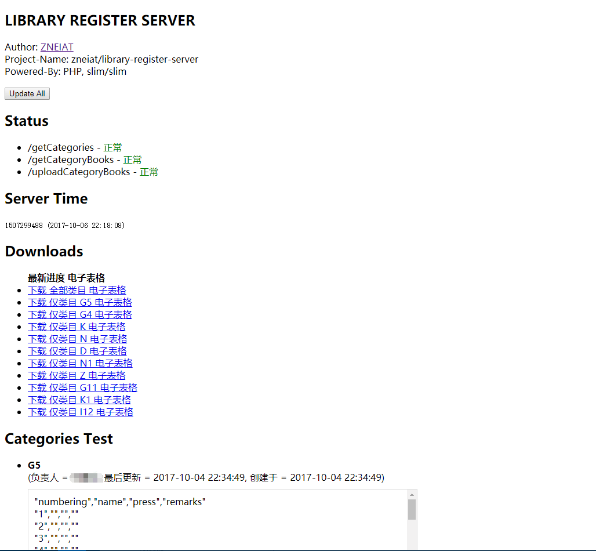
</p>